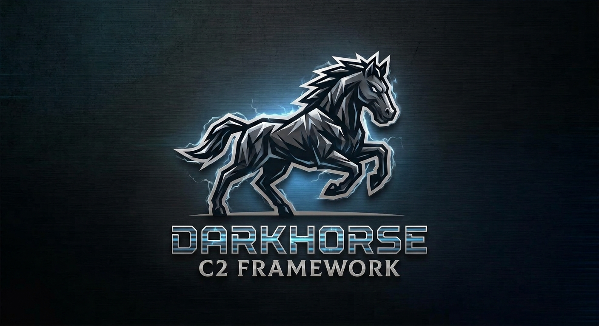

# DarkHorse

> A modern, modular Command & Control framework built for adversary simulation and red team operations.

## Status

🔴 Active development not production ready. No stable release yet.

## Overview

DarkHorse C2 is a post-exploitation framework designed for professional red teamers who need reliable, extensible infrastructure without vendor lock-in. Built with operational security and operator experience at its core.

## Planned Features

- **Async C2 communication** HTTP/S, DNS, and custom protocol listeners
- **Modular implant architecture** load only what the operation requires
- **Operator collaboration** multi-user teamserver with role-based access
- **OPSEC-first design** malleable traffic profiles, staged payloads
- **Extensible** write your own modules, listeners, and post-ex capabilities

## Roadmap

- [ ] Core teamserver (HTTP listener)
- [ ] Basic implant beacon loop
- [ ] Operator CLI
- [ ] Module loader
- [ ] DNS listener
- [ ] Malleable profiles

## Contributing

Follow for updates.
